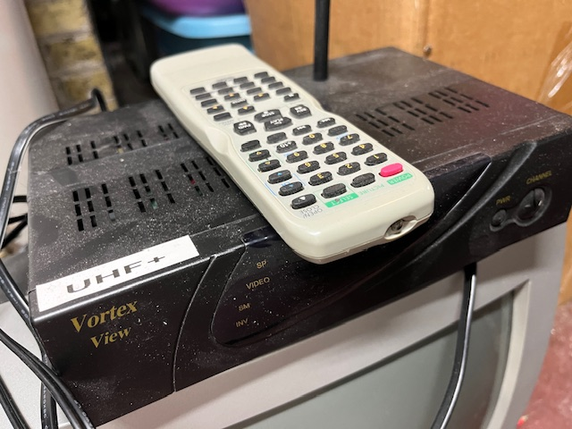

# UHF+

A new streaming device with the heart, soul and quality of UHF television.

# Description

This project's focus is to product a receiver akin to the old "cable box" which tunes-in quality [Peertube](https://peertube.tv/) broadcasts.  The goal is to provide a way to experience the ease and comfort of free, analog, over-the-air Television in the digital age.

To this end the "user inteface" is simple: a channel knob.  The knob cycles through the avaliable channels with the goal of changing channels as quickly as you can turn the knob.  

> Where do the channels come from?  Initially they'll be configured in a file in this repository but eventually maybe from somewhere more user-serviceable.

# References
* [Add RCA output to a Pi Zero](https://magpi.raspberrypi.com/articles/rca-pi-zero)
* [Raspberry Pi TV Simulator](https://github.com/Pakequis/Raspberry-pi-TV-sim)
