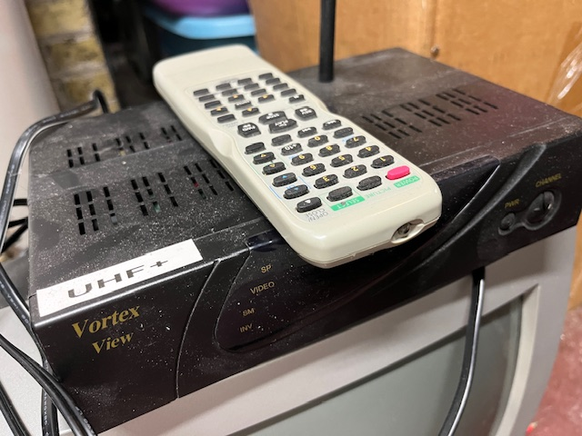
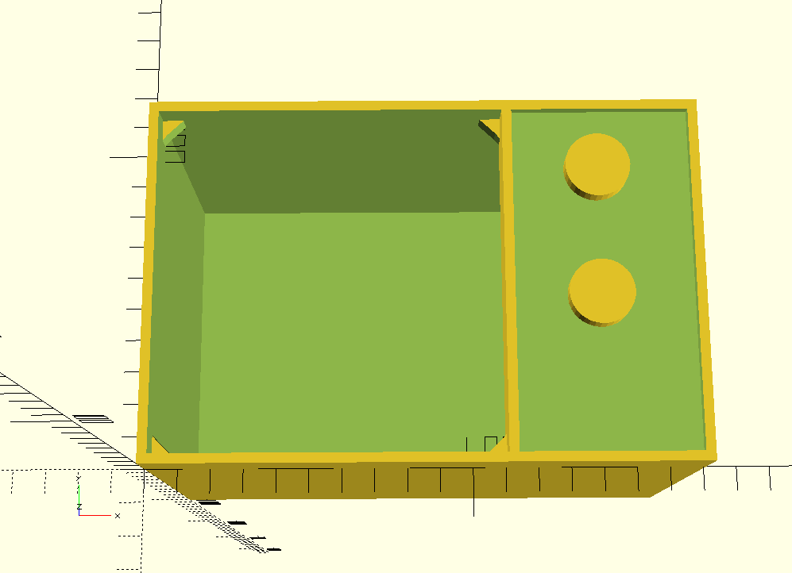

# UHF+

A new streaming device with the heart, soul and quality of UHF television.

## Overview 

This project's focus is to product a receiver akin to the old "cable box" which tunes-in quality [Peertube](https://peertube.tv/) broadcasts.  The goal is to provide a way to experience the ease and comfort of free, analog, over-the-air TV in the digital age.

To this end the "user inteface" is simple: a channel knob.  The knob cycles through the avaliable channels with the goal of changing channels as quickly as you can turn the knob.  

## Hardware

There's now two pieces of UHF+ hardware: [Type 1](./hardware/type1) and [Type 2](./hardware/type2).

Both devices are based on a single-board computer (currently [Raspberry Pi 3 Model A](https://www.raspberrypi.com/products/raspberry-pi-3-model-a-plus/)) and a SP12T switch to select channels.  Type-specific hardware is desribed in detail below.

### Type 1

Type 1 is the original set-top-box design intended for use with a standard television.

The prototype shown here was made from an off-the-shelf cable box, an old Raspberry Pi and a handmade power supply.  After experimentation it was found to be unsatisfying from both a technical and aesthetic perspective.  A new design based on a custom 3D-printed case is underway and will share the same mechanical channel control as the Type 2.

### Type 2

Type 2 is a stand-alone television designed for UHF+.  Type 2 incorporates the same features of Type 1 in the form of a small portable television set.  The design of this set is based off of the design we created for an [art project](https://www.printables.com/model/180019-irreverent-television-frame) and carries-on with the form and function of a traditional television experience.

## Firmware
The [firmware](firmware) should be mostly invisible to the viewer, but there will be a need to configure a few things.  Right now the plan for that is to provide a USB port where a keyboard can be attached, and when a keyboard is detected the device will launch into a configuration menu.  I have a few other ideas for this but right now this is my favorite, because it also means that the device *could* be used as a personal computer akin to the old 8-bit micros attached to televisions in the 1980's.

## Notes

## use VLC to stream a PeerTube livestream
`vlc https://beaverdamcommunity.tv/static/streaming-playlists/hls/b9a8ef0e-c3a3-4e95-bafc-99bc2a955b90/master.m3u8`

# References
* [Radical Software](https://radicalsoftware.org/e/volume1nr1_pics.html)
* [Add RCA output to a Pi Zero](https://magpi.raspberrypi.com/articles/rca-pi-zero)
* [Raspberry Pi TV Simulator](https://github.com/Pakequis/Raspberry-pi-TV-sim)
* [Rotary-Encoder (Python code to read encoder via GPIO)](https://github.com/modmypi/Rotary-Encoder/)
* [Console video playback without X](https://forums.raspberrypi.com/viewtopic.php?t=336093)
